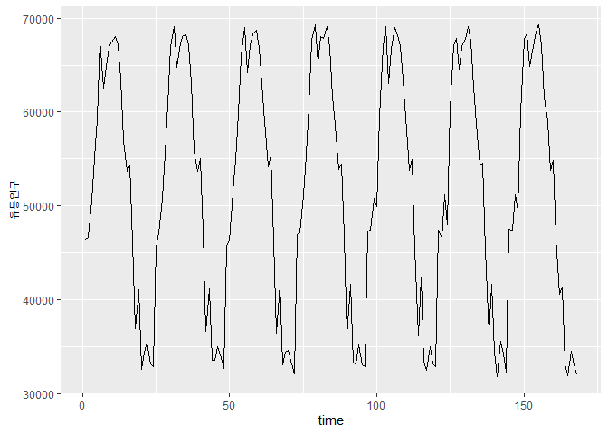
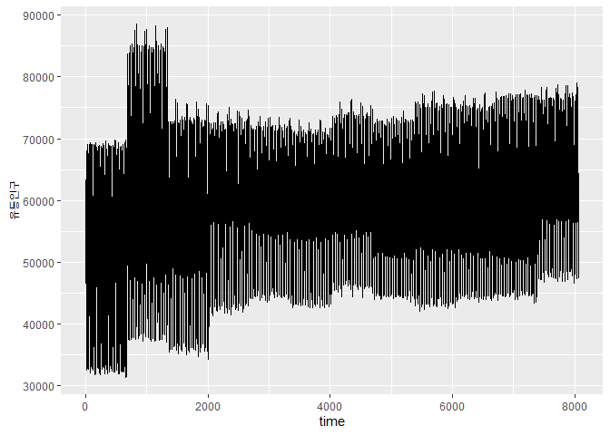

데이터 생성
-----------

시뮬레이션 데이터 생성….

    setwd("C:/Users/wnduq/Desktop")
    data1<-read.csv("월평균 시간대별 유동인구.csv")
    data2<-read.csv("월평균 연령별 유동인구.csv")
    data3<-read.csv("월평균 요일별 유동인구.csv")
    data4<-read.csv("월평균 성별 유동인구.csv")

    ##부전1동
    data_time<-data1[which(data1$분석영역=="부전1동"),]
    data_old<-data2[which(data2$분석영역=="부전1동"),]
    data_days<-data3[which(data3$읍면동=="부전제1동"),]
    data_sex<-data4[which(data4$읍면동=="부전제1동"),]
    #######################################################

    ###16년 화요일 missing(보간법)
    weds<-round((data_days[which(data_days$년==2016&data_days$요일=="월"),]$평균.유동인구+
                   data_days[which(data_days$년==2016&data_days$요일=="수"),]$평균.유동인구)/2)

    년=rep(2016,12)
    구군=rep("부산진구",12)
    읍명동=rep("부전제1동",12)
    요일="화"
    월=1:12
    주중.주말=rep("주중",12)
    평균.유동인구=weds
    add=cbind(년,구군,읍명동,요일,월,주중.주말,평균.유동인구)
    colnames(add)<-colnames(data_days)

    data_days=rbind(data_days,add)
    ##17년 4월까지
    data_days$평균.유동인구= as.integer(data_days$평균.유동인구)
    weds1<-round((data_days[which(data_days$월==1&data_days$년==2017&data_days$요일=="월"),]$평균.유동인구+
                    data_days[which(data_days$월==1&data_days$년==2017&data_days$요일=="수"),]$평균.유동인구)/2)
    weds2<-round((data_days[which(data_days$월==2&data_days$년==2017&data_days$요일=="월"),]$평균.유동인구+
                    data_days[which(data_days$월==2&data_days$년==2017&data_days$요일=="수"),]$평균.유동인구)/2)
    weds3<-round((data_days[which(data_days$월==3&data_days$년==2017&data_days$요일=="월"),]$평균.유동인구+
                    data_days[which(data_days$월==3&data_days$년==2017&data_days$요일=="수"),]$평균.유동인구)/2)
    weds4<-round((data_days[which(data_days$월==4&data_days$년==2017&data_days$요일=="월"),]$평균.유동인구+
                    data_days[which(data_days$월==4&data_days$년==2017&data_days$요일=="수"),]$평균.유동인구)/2)
    weds_17=c(weds1,weds2,weds3,weds4)
    년=rep(2017,4)
    구군=rep("부산진구",4)
    읍명동=rep("부전제1동",4)
    요일="화"
    월=1:4
    주중.주말=rep("주중",4)
    평균.유동인구=weds_17
    add=cbind(년,구군,읍명동,요일,월,주중.주말,평균.유동인구)
    colnames(add)<-colnames(data_days)
    data_days=rbind(data_days,add)
    ###################################################################
    #요일별비율
    #12*7*3+2*7
    dim(data_days)

    ## [1] 266   7

    head(data_days)

    ##      년     구군    읍면동 요일 월 주중.주말 평균.유동인구
    ## 8  2019 부산진구 부전제1동   일  2      주말         66314
    ## 9  2019 부산진구 부전제1동   월  2      주중         60716
    ## 10 2019 부산진구 부전제1동   화  2      주중         57976
    ## 11 2019 부산진구 부전제1동   수  2      주중         63802
    ## 12 2019 부산진구 부전제1동   목  2      주중         66515
    ## 13 2019 부산진구 부전제1동   금  2      주중         67755

    str(data_days)

    ## 'data.frame':    266 obs. of  7 variables:
    ##  $ 년           : chr  "2019" "2019" "2019" "2019" ...
    ##  $ 구군         : Factor w/ 4 levels "부산진구","사상구",..: 1 1 1 1 1 1 1 1 1 1 ...
    ##  $ 읍면동       : Factor w/ 6 levels "괘법동","남포동",..: 3 3 3 3 3 3 3 3 3 3 ...
    ##  $ 요일         : Factor w/ 7 levels "금","목","수",..: 5 4 7 3 2 1 6 5 4 7 ...
    ##  $ 월           : chr  "2" "2" "2" "2" ...
    ##  $ 주중.주말    : Factor w/ 2 levels "주말","주중": 1 2 2 2 2 2 1 1 2 2 ...
    ##  $ 평균.유동인구: chr  "66314" "60716" "57976" "63802" ...

    data_days$요일=factor(data_days$요일,levels = c("월","화","수","목","금","토","일"))
    data_days$년=factor(data_days$년,levels = 2016:2019)
    data_days$월=factor(data_days$월,levels = 1:12)
    data_days=dplyr::arrange(data_days,년, 월,요일)
    library(dplyr)

    ## 
    ## Attaching package: 'dplyr'

    ## The following objects are masked from 'package:stats':
    ## 
    ##     filter, lag

    ## The following objects are masked from 'package:base':
    ## 
    ##     intersect, setdiff, setequal, union

    data_days$평균.유동인구= as.integer(data_days$평균.유동인구)
    sum=data_days%>%
      group_by(년,월)%>%
      summarise(sum = sum(평균.유동인구))
    sum=rbind(sum,sum,sum,sum,sum,sum,sum)
    sum=sum %>%
      arrange(년,월)
    data_days$요일별비율= (data_days$평균.유동인구/sum$sum)
    tmp= rbind(data_days,data_days,data_days,data_days,data_days,data_days,data_days,data_days,data_days,data_days,data_days,
               data_days,data_days,data_days,data_days,data_days,data_days,data_days,data_days,data_days,data_days,data_days
               ,data_days,data_days)
    tmp=tmp %>%
      arrange(년,월, 요일)
    p_week=tmp$요일별비율
    length(p_week)/7

    ## [1] 912

    ###########################################
    ####난수추출
    data_time<-data1[which(data1$분석영역=="부전1동"),]
    name=as.character(as.vector(t(data_time)[1,]))
    월=as.vector(t(data_time)[1,])
    월=rep(월,c(rep(24*7,38)))
    data_time=t(data_time)[-(1:2),]
    temp=as.vector(data_time[,1])
    for(i in 2:38){
      temp=c(temp,as.vector(data_time[,i]))
    }
    mu=as.integer(temp)
    length(mu)

    ## [1] 912

    x=matrix(0,length(mu)*7,7)
    tmp=rep(0,4)
    for(i in 1:length(mu)){
      x=rbind(rnorm(4,p_week[7*i-6]*7*mu[i],500),
              rnorm(4,p_week[7*i-5]*7*mu[i],500),
              rnorm(4,p_week[7*i-4]*7*mu[i],500),
              rnorm(4,p_week[7*i-3]*7*mu[i],500),
              rnorm(4,p_week[7*i-2]*7*mu[i],500),
              rnorm(4,p_week[7*i-1]*7*mu[i],500),
              rnorm(4,p_week[7*i]*7*mu[i],500))
      tmp_2=x
      tmp=rbind(x,tmp)
    }
    tmp=tmp[-6385,]
    dim(tmp)

    ## [1] 6384    4

    factor=factor(rep(월,4),levels=name)
    #####날짜 달아주기
    ##여기서부터 문제있음...
    n=25536
    시간=rep(rep(0:23,rep(7,24)),n/(7*24))
    주차=rep(1:4,c(n/4,n/4,n/4,n/4))
    요일=rep(1:7,n/7)
    부전1동_유동_plat=cbind(c(tmp[,1],tmp[,2],tmp[,3],tmp[,4]),rep(월,4),주차,시간,요일)
    dim(부전1동_유동_plat)

    ## [1] 25536     5

    #24*28*(12*3+2)
    uo=부전1동_유동_plat
    uo=as.data.frame(uo)
    str(uo)

    ## 'data.frame':    25536 obs. of  5 variables:
    ##  $ V1  : Factor w/ 25536 levels "14415.4391066119",..: 9572 9811 9260 9612 9227 9705 9687 9716 9688 9389 ...
    ##   ..- attr(*, "names")= chr  "" "" "" "" ...
    ##  $ V2  : Factor w/ 38 levels "201601","201602",..: 1 1 1 1 1 1 1 1 1 1 ...
    ##   ..- attr(*, "names")= chr  "" "" "" "" ...
    ##  $ 주차: Factor w/ 4 levels "1","2","3","4": 1 1 1 1 1 1 1 1 1 1 ...
    ##   ..- attr(*, "names")= chr  "" "" "" "" ...
    ##  $ 시간: Factor w/ 24 levels "0","1","10","11",..: 1 1 1 1 1 1 1 2 2 2 ...
    ##   ..- attr(*, "names")= chr  "" "" "" "" ...
    ##  $ 요일: Factor w/ 7 levels "1","2","3","4",..: 1 2 3 4 5 6 7 1 2 3 ...
    ##   ..- attr(*, "names")= chr  "" "" "" "" ...

    uo$V2=factor
    uo$시간=as.integer(as.character(uo$시간))
    부전1동_유동_plat=uo%>%
      arrange(V2,주차,요일,시간)
    colnames(부전1동_유동_plat)[1]="유동인구"
    부전1동_유동_plat$유동인구=as.integer(as.character(부전1동_유동_plat$유동인구))
    time=1:25536
    부전1동_유동_plat$time=time
    24*12*28

    ## [1] 8064

    x11()
    library(ggplot2)
    ###하루치
    x11()
    ggplot(부전1동_유동_plat[1:24,], aes(x=time, y=유동인구)) +
      geom_line()

    ##일주일치
    x11()
    ggplot(부전1동_유동_plat[1:(24*7),], aes(x=time, y=유동인구)) +
      geom_line()

    ##한달치
    x11()
    ggplot(부전1동_유동_plat[1:(24*7*4),], aes(x=time, y=유동인구)) +
      geom_line()

    ##두달치
    x11()
    ggplot(부전1동_유동_plat[1:(24*7*4*2),], aes(x=time, y=유동인구)) +
      geom_line()

    ##일년치
    x11()
    ggplot(부전1동_유동_plat[1:(24*7*4*12),], aes(x=time, y=유동인구)) +
      geom_line()

    #########################################################################
    ###로그변환 해주면 좋을듯...
    ###새벽3 4 5시에 사람이 맣은?????
    #############성별연령별 컬럼 나누기
    ###일단위로 숫자뽑은뒤 비율로 변환...
    ###일단위로 랜덤하게 뽑기
    ###노이즈 섞어서 늘리고 이후에 비율화....
    data_sex<-data4[which(data4$읍면동=="부전제1동"),]
    data_old<-data2[which(data2$분석영역=="부전1동"),]
    data_old=data_old[-c(1:27),]
    #################
    data_sex$남자.전체.유동인구=as.integer(as.character(data_sex$남자.전체.유동인구))
    data_sex$여자.전체.유동인구=as.integer(as.character(data_sex$여자.전체.유동인구))
    data_sex$남성비율=(data_sex$남자.전체.유동인구)/((data_sex$남자.전체.유동인구)+(data_sex$여자.전체.유동인구))
    data_sex$여성비율=rep(1,38)-(data_sex$남성비율)
    p1=cbind(data_sex$남성비율,data_sex$여성비율)
    p1=cbind(p1,p1,p1,p1,p1,p1,p1)
    temp=cbind(data_old[,3],data_old[,3],data_old[,4],data_old[,4],data_old[,5],data_old[,5],
               data_old[,6],data_old[,6],data_old[,7],data_old[,7],data_old[,8],data_old[,8],
               data_old[,9],data_old[,9])*p1
    data_old=cbind(data_old[,c(1:2)],temp)
    colnames(data_old)[c(3:16)]=c("10대남","10대여","20대남","20대여","30대남","30대여",
                                  "40대남","40대여","50대남","50대여","60대남","60대여",
                                  "70대남","70대여")

    ########################################
    gnor=function(x){
      rnorm(14*24*28,rep(as.integer(x[-c(1:2)]),rep(24*28,14)),5)
    }
    tmp=apply(data_old,MARGIN = 1,FUN = gnor)
    dim(tmp)

    ## [1] 9408   38

    ###24*28개씪 끈어서 펴주기
    y=rep(0,25536)
    for(i in 0:13){
      y=cbind(y,as.vector(x=tmp[(24*28*i+1):(24*28*(i+1)),]))
    }
    y=y[,-1]
    dim(y)

    ## [1] 25536    14

    sum=apply(y,1,sum)
    length(sum)

    ## [1] 25536

    p=y/sum
    dim(p)

    ## [1] 25536    14

    부전1동_유동_last=cbind(p*부전1동_유동_plat[,1],부전1동_유동_plat[,6])
    dim(부전1동_유동_last)

    ## [1] 25536    15

    colnames(부전1동_유동_last)=c("남10대","여10대","이십대남","잇비대여","30대남","30대여",
                             "40대남","40대여","50대남","50대여","60대남","60대여",
                             "70대남","여70대","time")
    부전1동_유동_last=as.data.frame(부전1동_유동_last)

    ###하루치(10대남)
    x11()
    ggplot(부전1동_유동_last[1:24,], aes(x=time, y= 남10대)) +
      geom_line()

    x11()
    ggplot(부전1동_유동_last[1:24,], aes(x=time, y= 여70대)) +
      geom_line()

